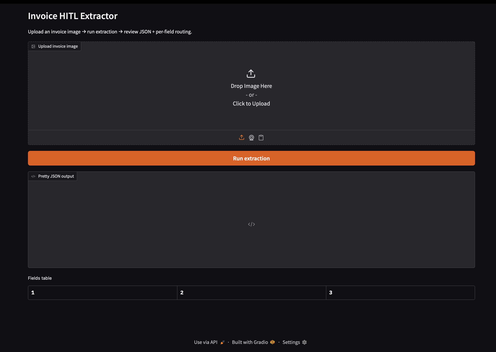
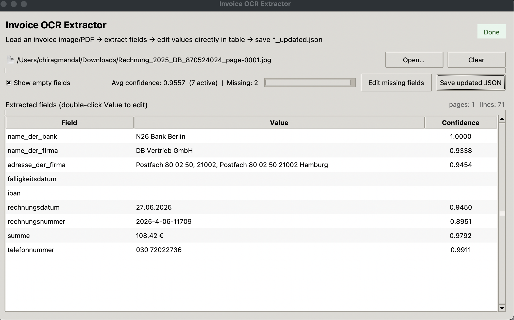

# Invoice Extraction & Human-in-the-Loop (Local)

This repo implements a local prototype to extract structured fields from German invoices:
- bank_name
- company_name
- company_address
- due_date
- iban
- invoice_date
- invoice_number
- total
- telephone

It includes:
- Part 1: OCR Tesseract model and local LLM fallback
    - OCR (Tesseract) model used for extraction
    - Rule-based extractors (regex + anchors + normalization + validators)
    - Local LLM fallback via Ollama for messy fields / low-confidence cases
    - Confidence scoring and field/invoice routing to humans (HitL)
    - Partial-label evaluation
- Part 2: Doctr OCR model and HITL incorporation
    - Second level invoice extraction using Doctr OCR recognition model 
    - A tkinter UI which helps edit the missing fields manually thereby enabling Human in the Loop interaction. 

## Repository Structure
```bash
invoice-hitl/
  src/invoice_hitl/
    run.py                 # batch pipeline (HF dataset)
    ui.py / gradio_ui.py    # gradio UI entrypoint (if present)
    ocr.py                 # tesseract OCR wrapper
    preprocess.py          # image preprocessing
    extractors/            # field-specific extractors
    confidence.py          # confidence combiner
    hitl.py                # routing logic
    llm.py                 # ollama client + prompt builder
    config.py              # Settings + thresholds
    validate.py            # validation helpers (IBAN, EUR amounts, etc.)
  outputs/
    predictions.jsonl
    debug/
  docker-compose.yml
  Dockerfile
  pyproject.toml
  .env                          #environment variables
  run_ui.sh                     #script to run the first level of extraction using Tesseract and LLM fallback
  requirements.txt              #requirements file for executing invoice_app_hitl_update.py
  invoice_app_hitl_update.py    #Second level of extraction and HITL incorporation
```

## Requirements
- Docker Desktop (Apple Silicon M1 supported)
- Enough disk for an Ollama model (several GB)


## Configure dataset
Create the .env file with below details: 
```bash
HF_DATASET_ID=Aoschu/donut_model_data_for_german_invoice
HF_DATASET_SPLIT=train
OLLAMA_MODEL=qwen2.5:3b-instruct
USE_LLM=1
OLLAMA_TIMEOUT_S=600
OLLAMA_CONNECT_TIMEOUT_S=10
OLLAMA_MAX_RETRIES=2
OLLAMA_BACKOFF_BASE_S=2.0
LLM_OCR_MAX_CHARS=3500
LIMIT=10
```
The huggingface dataset ID is passed through the .env file.

## Executing Part 1: OCR Tesseract model and local LLM fallback

### Start Ollama
```bash
docker-compose up -d ollama
```
### Run the batch pipeline (app service)
This runs python -m invoice_hitl.run inside the app container.

```bash
docker-compose up --build app
```

### Outputs
- outputs/predictions.jsonl (host)
- outputs/debug/ contains:
    - {invoice_id}_pre.png preprocessed images
    - {invoice_id}_ocr.txt OCR text dumps

### Running the Gradio UI (Docker)
```bash
./run_ui.sh
```

This should:
- start ollama
- build/start ui
- print the UI link (typically http://localhost:7860)



- Upload the image and click on Run extraction
- The JSON output, Fields table and Invoice Routing segments will be displayed once the extraction is complete


## Executing Part 2: Doctr OCR model and HITL incorporation

### Create and activate a conda environment
```bash
conda create -n invoice-ocr python=3.11 -y
conda activate invoice-ocr
```

### Install packages
```bash
conda install -c conda-forge tk -y
```

```bash
python -m pip install --upgrade pip
python -m pip install python-doctr pillow
```

### Execute the code
```bash
python invoice_app_hitl_update.py
```

### Tkinter UI (HITL)
The previous code will generate and open a Tkinter window looking like:

- Upload the input file
- In case of missing fields, double click the empty field and enter the missing values 
- Save the updated json file


